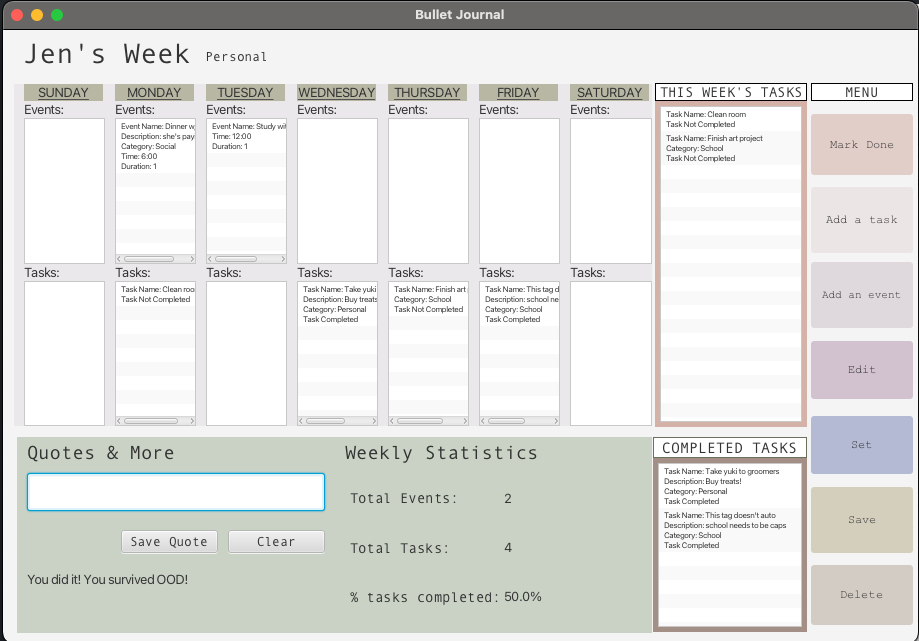

# 3500 PA05 Project Repo

[PA Write Up](https://markefontenot.notion.site/PA-05-8263d28a81a7473d8372c6579abd6481)

### Initial Design:

### What we ended up with:

# PITCH

Transform the way you plan, organize, and express yourself with ease and efficiency.
The Fire Hazard Bullet Journal provides users with access to a catered and seamless event management tool.

Our features include:

1. An intuitive user interface
    - seamlessly add events and tasks that can be categorized by SCHOOL, WORK, SOCIAL, PERSONAL, and/or IMPORTANT to
      maintain organization
    - effortlessly keep track of and manage which tasks are completed, and which are yet to be completed
    - made a mistake in creating an event or task? simply click on the edit button and the event or task you want to edit;
      or press delete to easily remove the item 
    - save your weeks with the click of a button in a personalized bujo file without missing any important information
2. Personal weekly statistics
    - Easily keep track of your busy week through a progress report of total events and tasks as
      well as a percent of tasks completed allowing for effortless goal management
3. Versatile quotes and notes
    - Allow your self to be inspired by our quote tool that lets users display a message of their choosing throughout
      the week
    - If quotes aren't your thing jog your memory by adding quick notes and reminders
4. Security
    - Protect the contents of your journal, and ensure absolute privacy with a password
    - Access your journal with the password '**_firehazard_** '. 

# SOLID

1. Single Responsibility Principle:
   We applied the single responsibility principle by separating each component of our program.
   For instance, we had an event class and also an event controller class. We did not apply elements of our model
   and those of our controller in just one class. Additionally, to further increase cohesion we created controllers
   for each element of bullet journal, i.e. events, tasks, creating a bujo file, reading a bujo file etc.

2. Open Close Principle:
   We maintained the open close principle by implementing several interfaces for specific tasks, such as adding an
   event or saving to a file. Rather than changing our classes we implemented interfaces or added methods to them.

3. Liskov Substitution Principle:
   We maintained this principle by first using interfaces rather than employing abstraction too early. Additionally,
   Our subclasses do not throw extra exceptions or follow different logic than the superclass. We made sure each
   return type was compatible in order to not violate the principle.

4. Interface Segregation Principle:
   We applied the interface segregation principle by creating interfaces with a cohesive and specific methods.
   We did not allow classes to implement methods from an interface if they only required some of them.

5. Dependency Inversion Principle:
   We applied the dependency inversion principle through dependency injection. Instead of instantiating new objects
   we passed them in through the constructor. For example we pass in the file name and associated constructor
   into our GuiView class.

# EXTENDING OUR PROGRAM

Our program can be extended by using the current buttons we have, i.e. delete, add an event, edit, etc. to create a
task bar. Using this task bar we can add keyboard shortcuts to open said buttons without pressing them. To extend our
events or tasks, for the mini viewer portion we can create a separate controller that opens a new
window when a task is clicked, this controller can be called in the journal implementation since it contains our week
view with tasks and events. Since we implemented the weekly overview, we can also use some of our code logic to create
a progress bar. The count can be updated in the journal controller implementation. To extend our view, since we
have getters for event/task name and duration we can implement sorting. In our create task controller we can simply
add a drop-down for sorting by time, name, or no sort then call the sorting methods in the controller implementations.

# IMAGE CREDIT
Splash gif: https://tenor.com/view/cat-yawn-cute-sleepy-tired-gif-15696533 
